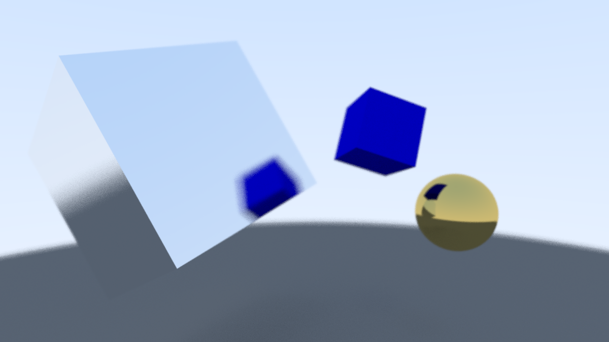
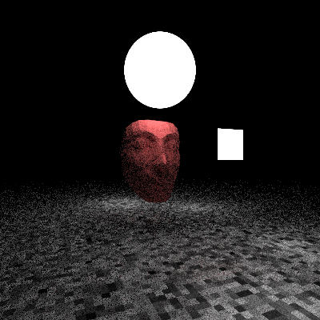
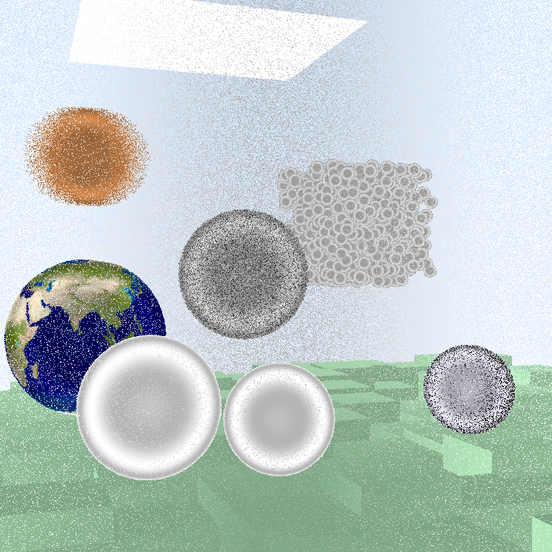

# Ray-Tracing



This repo is the implementation & extension of the following wonderful tutorials on ray-tracing:
- [_Ray Tracing in One Weekend_](https://raytracing.github.io/books/RayTracingInOneWeekend.html)
- [_Ray Tracing: The Next Week_](https://raytracing.github.io/books/RayTracingTheNextWeek.html)

Apart from the tutorials, following extensions were made:
- Dockerizing the pipelines: addition of build & development dockerfiles, more info under [1) Setup](#1-setup)
- Addition of testing with GoogleTest
- Implementation of custom cuboid class (arbitrary rotations defined by euler angles)
- Addition of mesh .obj files, defined by an array of triangular meshes, such as the following nefertiti mask:

&nbsp;&nbsp;&nbsp;&nbsp;&nbsp;&nbsp;
&nbsp;&nbsp;&nbsp;&nbsp;&nbsp;&nbsp;


- Custom camera->display function to display scenes without performing compute-heavy rendering:

Rendered Image             |  Displayed Image
:-------------------------:|:-------------------------:
  |  

Rendering took a little more than 2.5 hours, whereas the displaying took around 7 minutes on my personal machine.

## 1) Setup

The ray-tracer is containerized for both build (main branch) and development (development branch) workflows. Dockerfiles are under corresponding branches. Make sure that you have [docker desktop](https://www.docker.com/products/docker-desktop/) installed.

Build image directly outputs the ray-traced scene as a .ppm image, whereas development image creates a container in interactive mode to enable continuous development & testing.

Create image from dockerfile:

```console
docker build . -t ray-tracing
```

(Build Workflow) Create container from image:
```console
docker run \
-v ./outputs:/ray-tracing/outputs \
-d ray-tracing
```

(Development Workflow) Create container from image:
```console
docker run \
-v ./src:/ray-tracing/src:ro \
-v ./test:/ray-tracing/test:ro \
-v ./textures:/ray-tracing/textures:ro \
-v ./mesh:/ray-tracing/mesh:ro \
-v ./outputs:/ray-tracing/outputs \
-it ray-tracing
```

## 2) Getting Started

In order to use the development workflow, you have to run following commands (inside the container) for scene building:

```console
g++ src/main.cc -o main
```
```console
./main > outputs/image.ppm
```

... and testing:

```console
g++ test/vec3_test.cc \
/googletest/build/lib/libgtest.a \
-o vec3_test
```
```console
./vec3_test
```

Put your custom tests in **test/** directory and run above commands with your custom test names.

### 2.1) Creating Custom Scenes

You can create custom scenes in **main.cc** file. If you want to create scene from a mesh .obj file, make sure that it's a triangular mesh, and has the same style as the provided examples. **mesh_loader.h** is not robust, and will be improved in the future.

You can find custom mesh .obj files under following links:
- [Mesh link 1](https://hackmd.io/@mhyueh/HyTaZlgGd)
- [Mesh Link 2](https://github.com/alecjacobson/common-3d-test-models/blob/master/README.md)

If you have a compute-heavy scene like the dragon-mesh scene below, consider just displaying the scene using camera->display, instead of rendering with camera->render.


